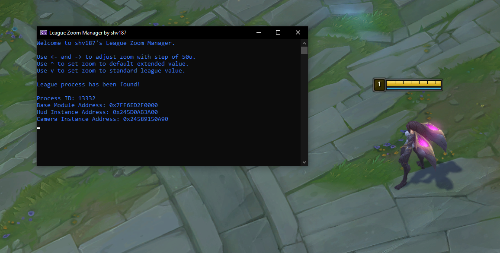

# League Zoom Manager

It's a simple Zoom Manager for League of Legends.

Can be used to record cool replays etc.

However It's prohibited by League to use this in standard game as It gives u an adventage, so I recommend not doing so.

**🚩 As stated in [issue](https://github.com/shv187/league-zoom-manager/issues/2) by @myo, It does not bypass League's checks so It may and mostlikely will flag and eventually ban your account. Use It only on 'throwaway' accounts :)**

## Usage
<kbd>←</kbd> and <kbd>→</kbd> adjusts zoom by 50u.

<kbd>↑</kbd> sets zoom to suggested extended zoom value.

<kbd>↓</kbd> resets zoom to League's default max zoom.

## Preview
### Legit

### With this tool

### UI

## Some Info
~~Updated as of 13.10, in the future I can add pattern scanning or any other option that wont require recompilation every patch.~~

Pattern scanning already implemented, however It takes some time every game launch. I'll try to improve It in future updates.

It's really easy to add fov changer if anyone is intrested in it, as It's basically in the source already.

I don't like how it looks so I haven't implemented it yet, but I can do it on request(create issue or something).

## Terms of usage
Feel free to use it, or contribute to it if You found any issues :--)
